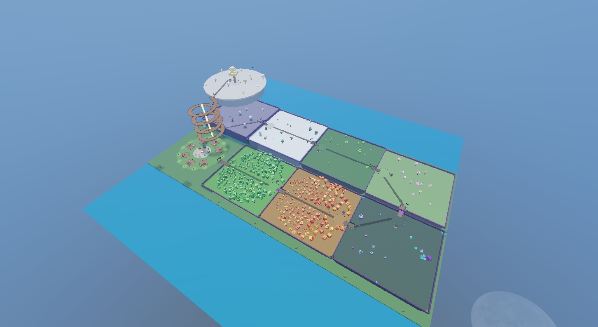

# Phase 1 continent validation — 2026-10-01

PlaceId: `93479990217075`, GameId: `10768831527`.

## Scope

Replaced the mountain with the approved S layout: rounded 500×480 ground zones, 500-stud grid with touching east/west borders and a 20-stud river, Root River and one eastern bridge, coastal low hills, and Sky Isles 300 studs above zone 7. Zones 1–2 contain 160 playable-tree markers each; zones 3–8 remain previews for Phase 7. Gates, warp stones, bosses, and other tagged objects are scaffolding for later systems.

## Results

- Edit-time route validation (`tools/map/ValidateRoutes.luau`): 2,048 samples, zero missing ground, surface mismatches, steps over 3.5 studs, or chest-height obstacles. Closed progression gates are excluded deliberately.
- Play: Humanoid MoveTo passed **all 16 generated routes** (8 connections + 8 zone trails). Ground connections walked at normal WalkSpeed 16; sky root used 80 and internal trails 40 to accelerate testing. Streaming was requested before positioning and periodically along routes. Each route was walked after its initial teleport; the character was not teleported between waypoints. Reproduce with `PreparePlayRoutes.luau` in Server, then `PlayRoutes.luau` in Client; inspect `_G.MapWalkTest` in Client. Gate openings are temporary Play-only changes.
- Output: `[Main] Chop a Tree server ready — Balance OK (8 checks)` and `[ProfileStore]: Roblox API services available - data will be saved`; no errors in the captured run.
- Boss-arena stones initially blocked 11 sampled segments; arena rings now leave openings along the trail. The compact revision adds 34-stud entrance notches in both soil and grass; ramps rise inside the adjacent zone instead of hitting its vertical edge. Flat trails stop before outgoing ramps. Final raycast validation passed after rebuilding all zones.
- Sources match Studio byte-for-byte after LF normalization: Zones 4,100 bytes/hash 1795469735; MapBuilder 45,794 bytes/hash 182475945 (hash recurrence `(h*31+byte)%2147483647`).
- Studio returned to Edit; the test's temporary gate openings were discarded.

## Counts

Tree 320; PreviewTree 84; ChestSpot 20; Nest 4; ZoneGate 7; WarpStone 9; ZoneSpawn 8; BossArena 8; Shrine 8; PlayerBase 7; GardenSlot 42; Shop 4; NPC 1; ForestGate 1; ArenaPortal 1; RealmGate 1; Lumora 1; Leaderboard 2; ChestAltar 1; BaseParts 4,619.

## Limits and next step

This validates map geometry and selected walking routes, not Phase 2 gameplay or final art. The upper zones intentionally contain preview objects. ArmZ rejected the wide spacing and requested touching zones; this report describes the compact revision. Obtain confirmation of this revision before Phase 2. The live Studio edit has not been published; Save/Publish the place in Studio when ready. The repository stores the builder and scripts, not the `.rbxl` place.
